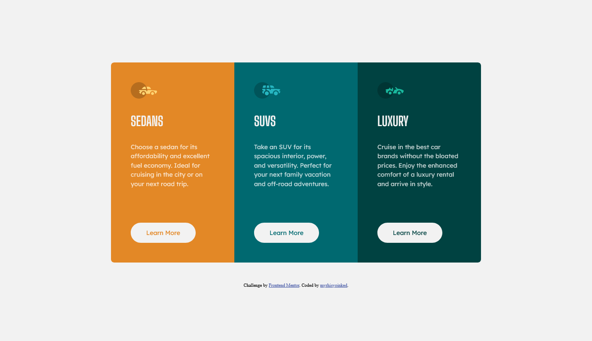
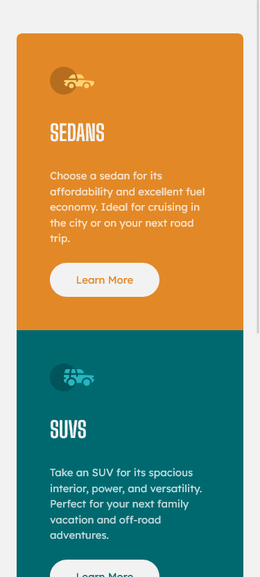

# Frontend Mentor - 3-column preview card component solution

This is a solution to the [3-column preview card component challenge on Frontend Mentor](https://www.frontendmentor.io/challenges/3column-preview-card-component-pH92eAR2-). Frontend Mentor challenges help you improve your coding skills by building realistic projects. 

## Table of contents

- [Overview](#overview)
  - [The challenge](#the-challenge)
  - [Screenshot](#screenshot)
  - [Links](#links)
- [My process](#my-process)
  - [Built with](#built-with)
  - [What I learned](#what-i-learned)
  - [Continued development](#continued-development)
  - [Useful resources](#useful-resources)
- [Author](#author)
- [Acknowledgments](#acknowledgments)

**Note: Delete this note and update the table of contents based on what sections you keep.**

## Overview

### The challenge

Users should be able to:

- View the optimal layout depending on their device's screen size
- See hover states for interactive elements

### Screenshot

### Links

- Solution URL: [https://github.com/myrhisyoinked/frontend-playground/tree/main/3-column preview card component](https://github.com/myrhisyoinked/frontend-playground/tree/main/3-column%20preview%20card%20component)
- Live Site URL: [https://myrhisyoinked.github.io/frontend-playground/3-column preview card component/](https://myrhisyoinked.github.io/frontend-playground/3-column%20preview%20card%20component/)

### Built with

- Semantic HTML5 markup
- CSS Grid
- Mobile-first workflow
- Pseudo-elements

### What I learned

Gained some more knowledge about responsive design and centering standalone elements vertically.

### Useful resources

- [chatgpt](https://www.chat.openai.com) - Gave me some ideas to center standalone element vertically.
## Author

- Github - [myrhisyoinked](https://github.com/myrhisyoinked)
- Frontend Mentor - [@myrhisyoinked](https://www.frontendmentor.io/profile/myrhisyoinked)