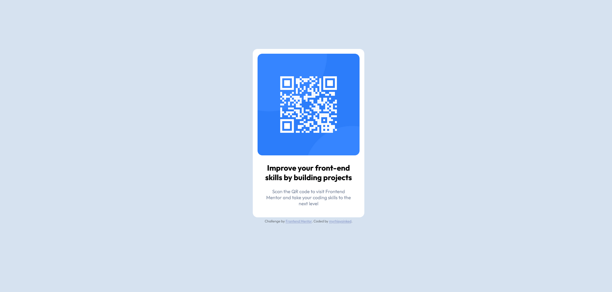

# Frontend Mentor - QR code component solution

This is a solution to the [QR code component challenge on Frontend Mentor](https://www.frontendmentor.io/challenges/qr-code-component-iux_sIO_H). Frontend Mentor challenges help you improve your coding skills by building realistic projects. 

## Table of contents

- [Overview](#overview)
  - [Screenshot](#screenshot)
  - [Links](#links)
- [My process](#my-process)
  - [Built with](#built-with)
  - [What I learned](#what-i-learned)
  - [Useful resources](#useful-resources)
- [Author](#author)

## Overview

### Screenshot



### Links

- Live Site URL: [https://myrhisyoinked.github.io/frontend-playground/QR code component/](https://myrhisyoinked.github.io/frontend-playground/QR%20code%20component/)
- Solution URL: [https://github.com/myrhisyoinked/frontend-playground/tree/main/QR code component](https://github.com/myrhisyoinked/frontend-playground/tree/main/QR%20code%20component)

## My process

### Built with

- Semantic HTML5 markup
- CSS
- Mobile-first workflow

### What I learned

Refreshred my knowledge of semantic, centering elements vertically and horizontaly 

```css
body {
    position: absolute;
    top: 40%;
    left: 50%;
    transform: translate(-50%, -40%);
}
```

### Useful resources

- [HTML Semantic cheat sheet](https://learntheweb.courses/topics/html-semantics-cheat-sheet/) - Use this if you want to refresh your semantic knowledge.
- [Horizontal & Vertical align](https://www.w3schools.com/css/css_align.asp) - Good article for understanding how to align items in css.

## Author

- Website - [myrhisyoinked](https://github.com/myrhisyoinked)
- Frontend Mentor - [@myrhisyoinked](https://www.frontendmentor.io/profile/myrhisyoinked)