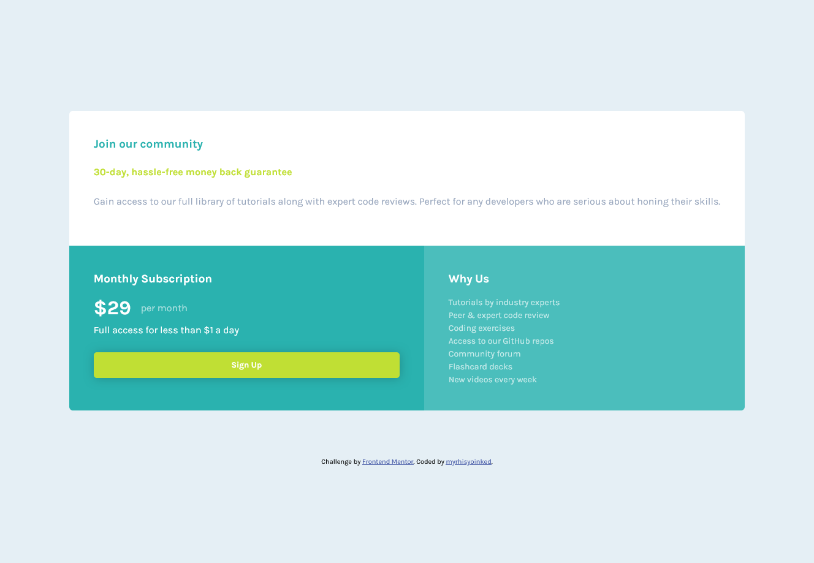

# Frontend Mentor - Single price grid component solution

This is a solution to the [Single price grid component challenge on Frontend Mentor](https://www.frontendmentor.io/challenges/single-price-grid-component-5ce41129d0ff452fec5abbbc). Frontend Mentor challenges help you improve your coding skills by building realistic projects. 

## Table of contents

- [Overview](#overview)
  - [The challenge](#the-challenge)
  - [Screenshot](#screenshot)
  - [Links](#links)
- [My process](#my-process)
  - [Built with](#built-with)
  - [What I learned](#what-i-learned)
- [Author](#author)
## Overview

### The challenge

Users should be able to:

- View the optimal layout for the component depending on their device's screen size
- See a hover state on desktop for the Sign Up call-to-action

### Screenshot




### Links

- Solution URL: [https://github.com/myrhisyoinked/frontend-playground/tree/main/Single%20price%20grid%20component](https://github.com/myrhisyoinked/frontend-playground/tree/main/Single%20price%20grid%20component)
- Live Site URL: [https://myrhisyoinked.github.io/frontend-playground/Single%20price%20grid%20component/](https://myrhisyoinked.github.io/frontend-playground/Single%20price%20grid%20component/)
### Built with

- Semantic HTML5 markup
- CSS Grid
- Mobile-first workflow
- Responsive design

### What I learned

I didn't work with grid a lot, so this was good experience.

```css
article {
  grid-template-areas: 
		"header header"
		"price footer";
}
```

## Author

- Website - [github.com/myrhisyoinked](https://github.com/myrhisyoinked)
- Frontend Mentor - [@myrhisyoinked](https://www.frontendmentor.io/profile/myrhisyoinked)