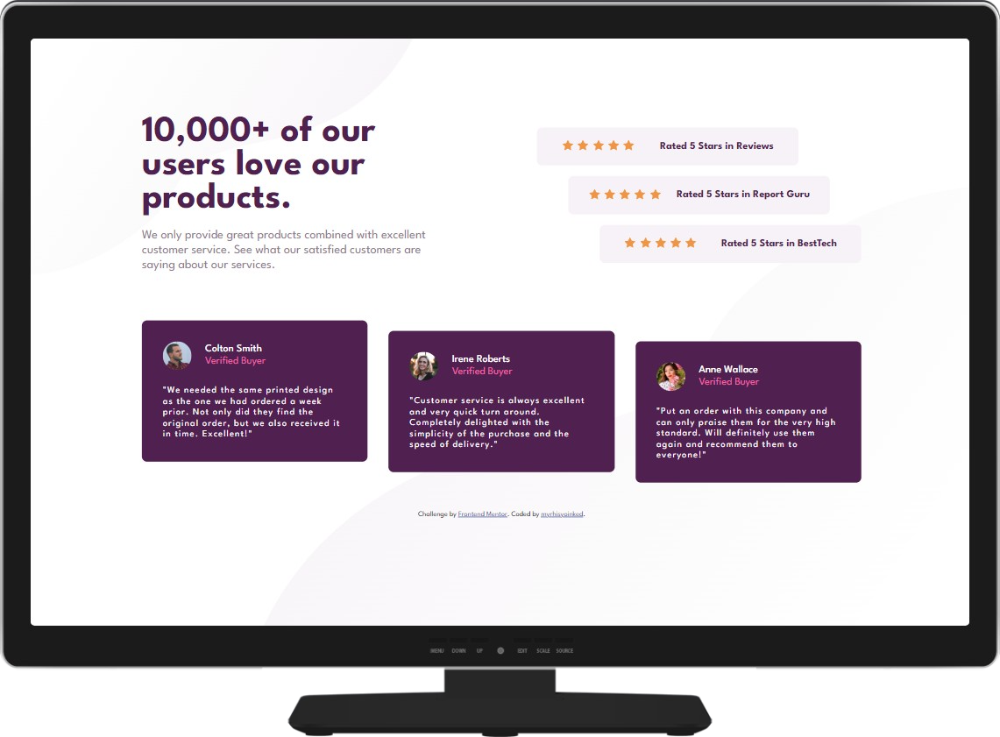
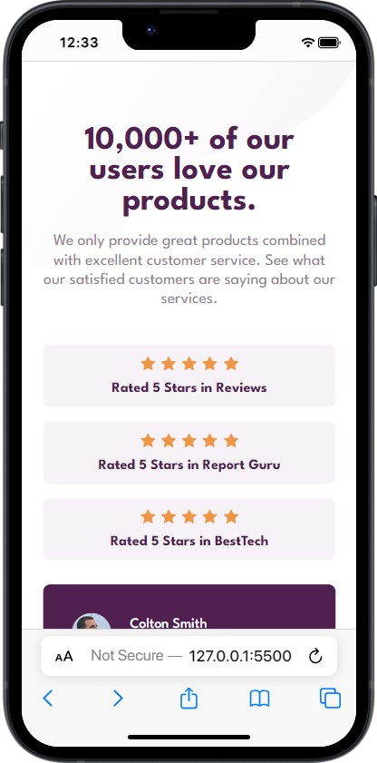

# Frontend Mentor - Social proof section solution

This is a solution to the [Social proof section challenge on Frontend Mentor](https://www.frontendmentor.io/challenges/social-proof-section-6e0qTv_bA). Frontend Mentor challenges help you improve your coding skills by building realistic projects.

## Table of contents

- [Overview](#overview)
  - [The challenge](#the-challenge)
  - [Screenshot](#screenshot)
  - [Links](#links)
- [My process](#my-process)
  - [Built with](#built-with)
- [Author](#author)

## Overview

### The challenge

Users should be able to:

- View the optimal layout for the section depending on their device's screen size

### Screenshot

### Links

- Solution URL: [solution](https://github.com/myrhisyoinked/frontend-playground/tree/main/Social%20proof%20section)
- Live Site URL: [live site](https://myrhisyoinked.github.io/frontend-playground/Social%20proof%20section/)

## My process

### Built with

- Semantic HTML5 markup
- Flexbox
- CSS Grid
- Mobile-first workflow

## Author

- Website - [github.com/myrhisyoinked](https://github.com/myrhisyoinked)
- Frontend Mentor - [@myrhisyoinked](https://www.frontendmentor.io/profile/myrhisyoinked)
